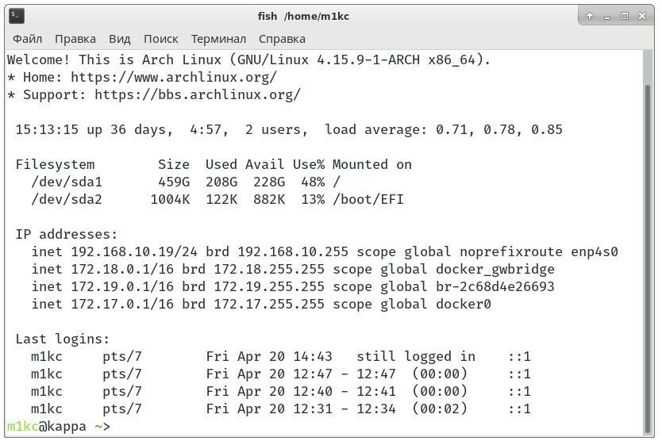

# motd

A portable fast MOTD similar to Ubuntu's.

Long story short:




## Installation

### As PAM login script (recommended)

1. Copy `motd.sh` to `/etc`.
2. Edit `/etc/pam.d/system-login`:

```diff
-session    optional   pam_motd.so          motd=/etc/motd
+session    optional   pam_exec.so          stdout /etc/motd.sh
```

#### For Debian ^11.6

1. Copy `motd.sh` to `/etc`.
2. Edit `/etc/pam.d/login` and `/etc/pam.d/sshd`:

```diff
-session    optional   pam_motd.so          motd=/run/motd.dynamic
+session    optional   pam_exec.so          stdout /etc/motd.sh
```

3. (Optional) Disable static motd message:

Edit `/etc/pam.d/login` and `/etc/pam.d/sshd`
```diff
-session    optional     pam_motd.so noupdate
```

### As fish prompt

1. Copy `motd.sh` to `/etc`.
2. Put this into your `~/.config/fish/config.fish`:

```fish
if [ xterm != "dumb" ]
  bash /etc/motd.sh; or echo "Failed to show MOTD."
end
```

If you don't like scripts in `/etc`, feel free to choose any other location.
